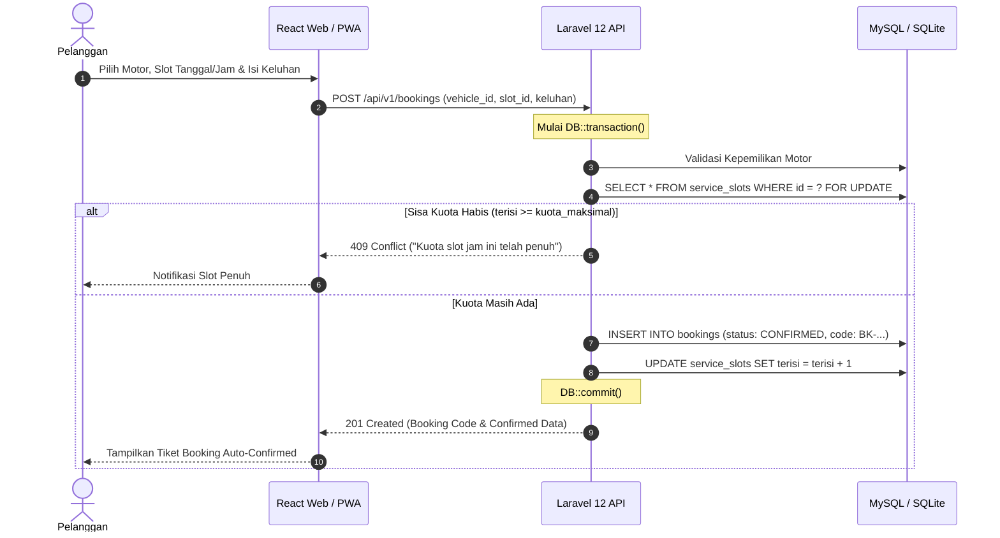

```mermaid
sequenceDiagram
    autonumber
    actor Pelanggan
    participant Frontend as React Web / PWA
    participant Backend as Laravel 12 API
    participant DB as MySQL / SQLite

    Pelanggan->>Frontend: Pilih Motor, Slot Tanggal/Jam & Isi Keluhan
    Frontend->>Backend: POST /api/v1/bookings (vehicle_id, slot_id, keluhan)
    Note over Backend: Mulai DB::transaction()
    Backend->>DB: Validasi Kepemilikan Motor
    Backend->>DB: SELECT * FROM service_slots WHERE id = ? FOR UPDATE
    alt Sisa Kuota Habis (terisi >= kuota_maksimal)
        Backend-->>Frontend: 409 Conflict ("Kuota slot jam ini telah penuh")
        Frontend-->>Pelanggan: Notifikasi Slot Penuh
    else Kuota Masih Ada
        Backend->>DB: INSERT INTO bookings (status: CONFIRMED, code: BK-...)
        Backend->>DB: UPDATE service_slots SET terisi = terisi + 1
        Note over Backend: DB::commit()
        Backend-->>Frontend: 201 Created (Booking Code & Confirmed Data)
        Frontend-->>Pelanggan: Tampilkan Tiket Booking Auto-Confirmed
    end
```
