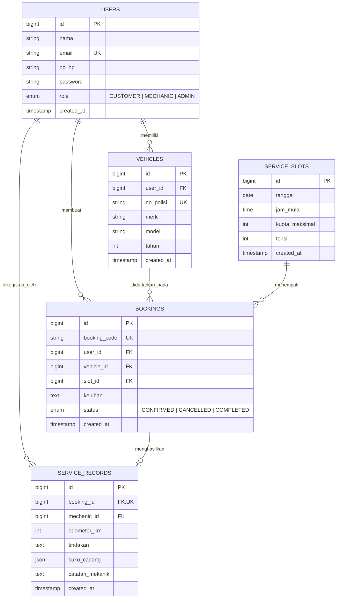

```mermaid
erDiagram
    USERS ||--o{ VEHICLES : "memiliki"
    USERS ||--o{ BOOKINGS : "membuat"
    USERS ||--o{ SERVICE_RECORDS : "dikerjakan_oleh"
    VEHICLES ||--o{ BOOKINGS : "didaftarkan_pada"
    SERVICE_SLOTS ||--o{ BOOKINGS : "menempati"
    BOOKINGS ||--o| SERVICE_RECORDS : "menghasilkan"

    USERS {
        bigint id PK
        string nama
        string email UK
        string no_hp
        string password
        enum role "CUSTOMER | MECHANIC | ADMIN"
        timestamp created_at
    }

    VEHICLES {
        bigint id PK
        bigint user_id FK
        string no_polisi UK
        string merk
        string model
        int tahun
        timestamp created_at
    }

    SERVICE_SLOTS {
        bigint id PK
        date tanggal
        time jam_mulai
        int kuota_maksimal
        int terisi
        timestamp created_at
    }

    BOOKINGS {
        bigint id PK
        string booking_code UK
        bigint user_id FK
        bigint vehicle_id FK
        bigint slot_id FK
        text keluhan
        enum status "CONFIRMED | CANCELLED | COMPLETED"
        timestamp created_at
    }

    SERVICE_RECORDS {
        bigint id PK
        bigint booking_id FK,UK
        bigint mechanic_id FK
        int odometer_km
        text tindakan
        json suku_cadang
        text catatan_mekanik
        timestamp created_at
    }
```
