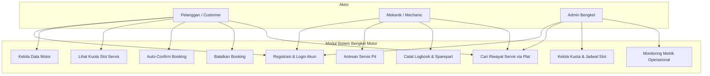

```mermaid
graph TD
    subgraph Aktor
        C[Pelanggan / Customer]
        M[Mekanik / Mechanic]
        A[Admin Bengkel]
    end

    subgraph Modul Sistem Bengkel Motor
        UC1[Registrasi & Login Akun]
        UC2[Kelola Data Motor]
        UC3[Lihat Kuota Slot Servis]
        UC4[Auto-Confirm Booking]
        UC5[Batalkan Booking]
        UC6[Antrean Servis Pit]
        UC7[Catat Logbook & Sparepart]
        UC8[Cari Riwayat Servis via Plat]
        UC9[Kelola Kuota & Jadwal Slot]
        UC10[Monitoring Metrik Operasional]
    end

    C --> UC1
    C --> UC2
    C --> UC3
    C --> UC4
    C --> UC5
    C --> UC8

    M --> UC1
    M --> UC6
    M --> UC7
    M --> UC8

    A --> UC1
    A --> UC8
    A --> UC9
    A --> UC10
```
