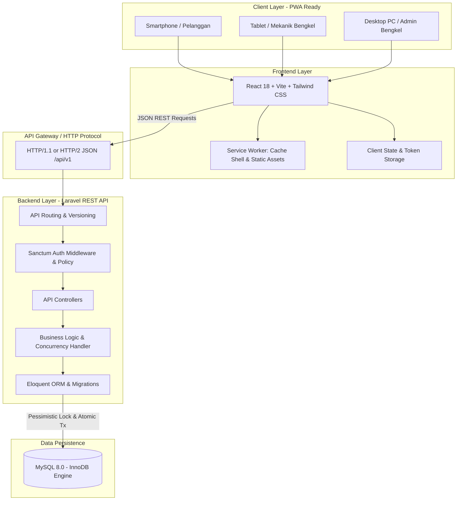

# ARSITEKTUR SISTEM & EVALUASI TEKNOLOGI (SYSTEM ARCHITECTURE)

## 1. High-Level Architecture Overview

Sistem dibangun dengan pola arsitektur **Decoupled Single-Repository Web Application**:
- **Backend**: Laravel REST API melayani endpoint JSON dengan otentikasi stateless token (Sanctum).
- **Frontend**: Single Page Application (SPA) berbasis React, TypeScript, dan Vite yang dirancang responsif (mobile, tablet, desktop) dan disiapkan untuk Progressive Web App (PWA).
- **Komunikasi**: Protokol HTTP/HTTPS murni menggunakan payload JSON dengan versioning API `/api/v1`.
- **Database**: Database Relasional Tunggal (RDBMS) dengan dukungan ACID transactions penuh.



---

## 2. Evaluasi dan Rekomendasi Technology Stack

### A. Backend: Laravel (PHP 8.2+) & Laravel Sanctum
- **Rekomendasi**: Laravel REST API.
- **Alasan Pemilihan**:
  1. *Eksplisit dalam PDF*: PDF secara jelas menyebutkan *"Backend REST API berbasis Laravel yang mengelola validasi kuota slot harian, pencatatan rekam servis, autentikasi berbasis token..."*.
  2. *Keamanan bawaan*: FormRequest validator, query parameter binding anti-SQL Injection, perlindungan CSRF/CORS terkonfigurasi matang.
  3. *Manajemen Token Ringan*: Laravel Sanctum menyediakan autentikasi API token stateless yang efisien tanpa overhead kompleksitas microservices OAuth2/Passport.
  4. *Transaction Management*: Mendukung `DB::transaction()` dan pessimistic locking (`lockForUpdate()`) secara native dan handal.

### B. Database: MySQL 8.0 (InnoDB Engine)
- **Evaluasi vs PostgreSQL**:
  - *PostgreSQL*: Sangat kuat pada tipe data kompleks (JSONB, GIS, RLS), namun overhead konfigurasi lokal mahasiswa lebih tinggi.
  - *MySQL (InnoDB)*: Standar de-facto pada kurikulum web development, terintegrasi mulus di stack lokal (XAMPP / Laragon / Docker), dan engine InnoDB mendukung penuh ACID, row-level locking (`SELECT ... FOR UPDATE`), dan foreign key constraints.
- **Rekomendasi**: **MySQL 8.0 / MariaDB 10.4+** dengan InnoDB engine. Trade-off ini memaksimalkan kemudahan setup tanpa mengorbankan integritas data transaksi.

### C. Frontend: React 18 + TypeScript + Vite + Tailwind CSS
- **Rekomendasi**: React 18 + TypeScript + Vite.
- **Alasan Pemilihan**:
  1. *Keamanan Tipe (TypeScript)*: Menjamin kontrak payload JSON dari backend Laravel terdefinisi jelas di sisi frontend (`types/api.ts`), mencegah runtime error.
  2. *Build Tool Cepat (Vite)*: Mendukung Fast Refresh instan dan integrasi mudah dengan `vite-plugin-pwa`.
  3. *Tailwind CSS*: Mempermudah perancangan antarmuka adaptif yang responsif untuk 3 jenis layar target (layar smartphone pelanggan, tablet mekanik, dan monitor admin).
  4. *Kesiapan PWA*: Ekosistem Vite PWA memudahkan pendaftaran Web App Manifest dan Workbox Service Worker tanpa modifikasi struktur kode dasar.

### D. Testing & Quality Assurance
- **Backend API Testing**: PHPUnit / Pest (Laravel Feature Test) untuk memverifikasi HTTP response status code, struktur JSON, otorisasi, dan uji batas kuota.
- **API Client Inspection**: Postman (memenuhi syarat pengujian praktikum inspeksi HTTP A, B, C).
- **Dokumentasi API**: OpenAPI 3.0 / Postman Collection v2.1.

---

## 3. Concurrency Control & Pencegahan Overbooking (Critical Engine)

Tantangan utama sistem reservasi adalah **Race Condition**: dua pelanggan melakukan checkout pada satu slot terakhir di detik yang sama.

### Solusi Teknis: Pessimistic Row Locking (`SELECT ... FOR UPDATE`)
Laravel mengeksekusi proses reservasi di dalam closure `DB::transaction()`:

```php
// Alur Concurrency Control di BookingService.php
return DB::transaction(function () use ($request, $user) {
    // 1. Kunci baris slot servis agar request lain harus mengantre
    $slot = ServiceSlot::where('id', $request->slot_id)
        ->lockForUpdate()
        ->firstOrFail();

    // 2. Evaluasi kuota aktual di dalam baris yang terkunci
    if ($slot->terisi >= $slot->kuota_maksimal) {
        // Kuota habis -> batalkan transaksi dan lempar HTTP 409 Conflict
        throw new SlotQuotaFullException("Kuota slot servis untuk jam ini telah penuh.");
    }

    // 3. Buat booking baru dengan status CONFIRMED (Auto-Confirm)
    $booking = Booking::create([
        'booking_code' => 'BK-' . strtoupper(Str::random(6)),
        'vehicle_id'   => $request->vehicle_id,
        'slot_id'      => $slot->id,
        'keluhan'      => $request->keluhan,
        'status'       => 'CONFIRMED',
    ]);

    // 4. Inkrement kuota terisi
    $slot->increment('terisi');

    // 5. Commit transaksi otomatis dilakukan oleh Laravel
    return $booking;
});
```

- **Jaminan Konsistensi**: Request kedua yang datang bersamaan akan menunggu hingga lock request pertama selesai. Ketika request kedua membaca baris slot, nilai `terisi` sudah bertambah, sehingga request kedua langsung masuk ke kondisi `SlotQuotaFullException` dan menerima respons `409 Conflict`. Overbooking mustahil terjadi.

---

## 4. PWA Readiness Architecture

Pengembangan PWA dibagi menjadi 3 tahapan realistis:

### Fase 1: Mobile-First Responsive Foundation (Scope Utama)
- Tampilan berbasis grid dan flexbox adaptif Tailwind CSS.
- Komponen input ramah layar sentuh untuk tablet mekanik di area bengkel yang berminyak/kotor.
- Stateless HTTP client (Axios / Fetch) dengan interceptor token dan error handling seragam.

### Fase 2: PWA Installability & Caching Aset (PWA Target)
- Penyediaan file `manifest.json` (Nama aplikasi, icon berbagai resolusi, display mode `standalone`, theme color).
- Registrasi Service Worker via Vite PWA untuk caching aset statis (HTML, JS, CSS, Font, Logo).
- Aplikasi dapat diinstal ke Home Screen Android/iOS/Desktop.

### Fase 3: Batasan Offline vs Online (Arsitektur Integritas)
- **Fitur Read-Only Offline**: Data profil pelanggan dan riwayat servis kendaraan yang pernah dibuka dapat dibaca dari IndexedDB / Cache Storage saat koneksi terputus.
- **Fitur Wajib Online**: Booking dan perubahan slot **tidak diizinkan offline** karena perhitungan kuota dan locking memerlukan validasi server secara real-time. Jika offline, antarmuka menampilkan indikator banner *"Koneksi terputus: Anda memerlukan jaringan internet untuk membuat reservasi"*.

---

## 5. Security & Reliability Architecture

1. **Authentication Token**: Token Sanctum di-hash dengan SHA-256 di database (`personal_access_tokens`).
2. **Strict Authorization**: Laravel Policy (`VehiclePolicy`, `BookingPolicy`) memverifikasi kepemilikan:
   ```php
   public function update(User $user, Vehicle $vehicle): bool {
       return $user->id === $vehicle->user_id;
   }
   ```
3. **Data Sanitization**: Seluruh input difilter melalui `FormRequest::validated()`, menolak field tambahan yang tidak diizinkan.
4. **Rate Limiting**: Rate limiter bawaan Laravel (`throttle:60,1`) pada route API publik untuk mencegah brute-force login dan denial of service.
5. **No Token in Logs**: Konfigurasi logging Laravel dikustomisasi untuk me-redact header `Authorization` dan kata sandi.
