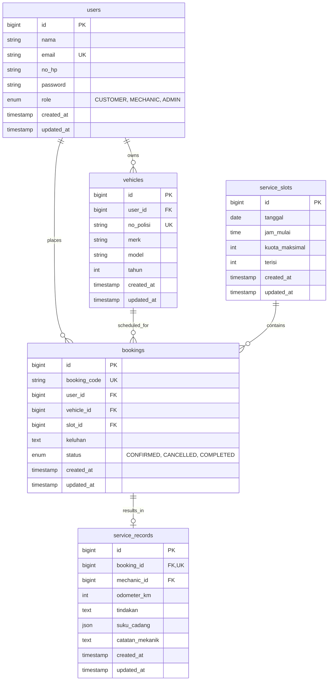

# SPESIFIKASI TEKNIS & DOKUMEN PERENCANAAN SISTEM (PROJECT SPECIFICATION)
**Single Source of Truth (SSOT)**

---

## 1. Project Overview

- **Nama Proyek**: Sistem Informasi Layanan Penjadwalan Servis dan Manajemen Riwayat Perawatan Berkala Bengkel Motor
- **Mata Kuliah**: Pemrograman Web Service (Tahun Akademik 2026/2027)
- **Institusi**: Universitas Harkat Negeri
- **Kelompok**: Kelompok 2
- **Anggota Tim**:
  1. Intan Komalasari
  2. Feldi Sanjaya
  3. Imzy Zulijar Setiawan
  4. Eko Saputro (NIM: 23215050)
  5. Zakky Fawwaz Mubarok
- **Status Dokumen**: Approved Baseline for Implementation (Phase 0 Planning Complete)

---

## 2. Background & Problem Statement

### 2.1 Latar Belakang
Pada operasional bengkel motor konvensional, penumpukan antrean kendaraan sering terjadi karena ketiadaan manajemen kuota slot pengerjaan harian. Pelanggan datang secara acak tanpa kepastian waktu tunggu. Selain itu, riwayat perawatan (penggantian sparepart, oli, dan tindakan servis) masih dicatat secara manual pada nota kertas yang mudah rusak/hilang. Akibatnya, mekanik kesulitan melacak riwayat kondisi motor saat kendaraan kembali diservis.

### 2.2 Problem Statement
1. **Ketidakpastian Waktu Antrean**: Pelanggan membuang waktu menunggu giliran servis tanpa adanya alokasi jam pengerjaan yang pasti.
2. **Riwayat Servis Terfragmentasi**: Mekanik dan pemilik bengkel tidak memiliki rekam jejak digital perbaikan masa lalu berbasis nomor polisi kendaraan.
3. **Ketiadaan Standarisasi Komunikasi Data**: Belum tersedianya antarmuka RESTful API terstruktur untuk integrasi sistem antrean pelanggan dan modul pencatatan mekanik.

---

## 3. Objectives, Scope & Out of Scope

### 3.1 Tujuan Proyek (Objectives)
1. Membangun backend **RESTful API** berbasis **Laravel** dengan format data JSON untuk penjadwalan servis harian.
2. Menyediakan layanan **Digital Service Logbook** berbasis nomor polisi kendaraan untuk pencatatan riwayat perawatan berkala.
3. Menerapkan mekanisme **Auto-Confirm Booking** dengan kontrol konkurensi data (mencegah overbooking).
4. Menyediakan objek praktikum inspeksi HTTP (GET, POST, Error Testing) yang kompatibel dengan Postman Client.
5. Mempersiapkan arsitektur frontend web responsif modular yang siap dikembangkan menjadi **Progressive Web App (PWA)**.

### 3.2 Ruang Lingkup (In-Scope)
- **Autentikasi & Otorisasi**: Register, Login, Me, Logout berbasis Laravel Sanctum Token.
- **Manajemen Kendaraan (CRUD)**: Pendaftaran motor pelanggan, verifikasi kepemilikan.
- **Manajemen Slot Servis**: Pengecekan ketersediaan kuota harian per jam operasional.
- **Reservasi & Pembatalan Booking**: Booking langsung terkonfirmasi (Auto-Confirm) jika kuota tersedia, pembatalan mandiri sebelum jadwal.
- **Logbook Servis Mekanik**: Pencatatan odometer (KM), tindakan servis, dan daftar suku cadang/oli yang diganti.
- **Riwayat Servis Terbuka**: Pelacakan riwayat servis lengkap berdasarkan nomor polisi kendaraan.
- **Pengujian & Dokumentasi**: Dokumentasi OpenAPI/Postman Collection dan HTTP status code testing.

### 3.3 Di Luar Ruang Lingkup (Out-of-Scope)
- Payment Gateway online (pembayaran diselesaikan tunai/offline di kasir bengkel).
- WhatsApp Gateway notifikasi berbayar.
- Modul akuntansi keuangan laba/rugi bengkel yang kompleks.
- Aplikasi native mobile Android/iOS (fokus pada Responsive Web / PWA).

---

## 4. Stakeholders & User Roles

| Role | Deskripsi & Tanggung Jawab | Akses Utama |
| :--- | :--- | :--- |
| **CUSTOMER** (Pelanggan) | Pemilik kendaraan motor yang melakukan booking dan memantau status kendaraannya. | Kelola profil motor sendiri, cek kuota slot, booking servis, batalkan booking sendiri, lihat riwayat servis motor sendiri. |
| **MECHANIC** (Mekanik) | Teknisi bengkel yang menangani pengerjaan fisik motor dan mencatat tindakan servis. | Lihat antrean servis aktif, catat odometer, input tindakan perbaikan & suku cadang, tandai servis selesai (`COMPLETED`). |
| **ADMIN** (Admin Bengkel) | Pengelola operasional bengkel dan jadwal slot harian. | Kelola master slot servis harian, pantau seluruh booking, override status booking jika terjadi kendala fisik di bengkel. |

---

## 5. Functional & Non-Functional Requirements

### 5.1 Klasifikasi Label Sumber
- `[PDF]`: Kebutuhan eksplisit dari dokumen PDF acuan tugas kelompok.
- `[BASE]`: Keputusan arsitektur dan aturan bisnis baseline yang telah disepakati.
- `[REK]`: Rekomendasi teknis Senior Architect untuk ketahanan sistem.

### 5.2 Functional Requirements (FR)

#### A. Autentikasi & Manajemen Akun (AUTH)
- **FR-AUTH-001 [PDF]**: Sistem harus menyediakan endpoint pendaftaran akun pelanggan (`POST /api/v1/auth/register`) dengan atribut: nama, email, no_hp, password.
- **FR-AUTH-002 [PDF]**: Sistem harus menyediakan endpoint autentikasi (`POST /api/v1/auth/login`) yang mengembalikan token Sanctum dan objek user.
- **FR-AUTH-003 [PDF]**: Sistem harus menyediakan endpoint identitas akun aktif (`GET /api/v1/auth/me`).
- **FR-AUTH-004 [REK]**: Sistem harus menyediakan endpoint pencabutan token (`POST /api/v1/auth/logout`).
- **FR-AUTH-005 [BASE]**: Sistem harus menegakkan 3 role pengguna (`CUSTOMER`, `MECHANIC`, `ADMIN`).

#### B. Manajemen Kendaraan (VEH)
- **FR-VEH-001 [PDF]**: Pelanggan dapat mendaftarkan kendaraan (`POST /api/v1/vehicles`) dengan atribut: nomor polisi, merk, model, tahun.
- **FR-VEH-002 [PDF]**: Pelanggan dapat melihat seluruh kendaraan miliknya (`GET /api/v1/vehicles`).
- **FR-VEH-003 [PDF]**: Pelanggan dapat melihat detail kendaraan spesifik miliknya (`GET /api/v1/vehicles/{id}`).
- **FR-VEH-004 [REK]**: Pelanggan dapat memperbarui dan menghapus data kendaraan miliknya (`PUT/DELETE /api/v1/vehicles/{id}`).
- **FR-VEH-005 [BASE]**: Sistem wajib memvalidasi format nomor polisi unik per kendaraan.

#### C. Manajemen Slot Servis (SLOT)
- **FR-SLOT-001 [PDF]**: Pengguna dapat memeriksa ketersediaan slot servis berdasarkan parameter tanggal (`GET /api/v1/service-slots?tanggal=YYYY-MM-DD`).
- **FR-SLOT-002 [PDF]**: Data slot mencakup: tanggal, jam_mulai, kuota_maksimal, terisi, dan status ketersediaan.
- **FR-SLOT-003 [BASE]**: Admin dapat menginisiasi dan mengelola kuota slot harian (`POST/PUT /api/v1/service-slots`).

#### D. Reservasi Servis / Booking (BOOK)
- **FR-BOOK-001 [PDF]**: Pelanggan dapat membuat reservasi servis (`POST /api/v1/bookings`) dengan memilih kendaraan, slot servis, dan keluhan.
- **FR-BOOK-002 [BASE]**: Sistem menerapkan **Auto-Confirm**: status booking otomatis `CONFIRMED` jika kuota slot masih tersedia saat transaksi diproses.
- **FR-BOOK-003 [PDF]**: Pelanggan dapat membatalkan reservasi miliknya (`PATCH /api/v1/bookings/{id}/cancel`).
- **FR-BOOK-004 [PDF]**: Sistem menolak booking dan mengembalikan respon error 409/422 jika kuota slot telah penuh.
- **FR-BOOK-005 [REK]**: Sistem mencegah pelanggan melakukan lebih dari satu booking aktif pada kendaraan yang sama di slot waktu yang sama.

#### E. Pencatatan Servis & Logbook Mekanik (SERV)
- **FR-SERV-001 [PDF]**: Mekanik dapat melihat daftar booking aktif berstatus `CONFIRMED` untuk dikerjakan (`GET /api/v1/mechanic/bookings`).
- **FR-SERV-002 [PDF]**: Mekanik dapat mencatat hasil servis (`POST /api/v1/service-records`) meliputi: odometer_km, tindakan perbaikan, daftar suku cadang/oli, dan catatan teknis.
- **FR-SERV-003 [PDF]**: Pencatatan servis otomatis memperbarui status booking menjadi `COMPLETED`.

#### F. Riwayat Servis & Pelacakan (HIST)
- **FR-HIST-001 [PDF]**: Sistem menyediakan endpoint pelacakan riwayat servis kendaraan berdasarkan nomor polisi (`GET /api/v1/service-history?no_polisi=...`).
- **FR-HIST-002 [PDF]**: Pelanggan dapat melihat riwayat lengkap perawatan seluruh kendaraannya secara kronologis.

---

### 5.3 Non-Functional Requirements (NFR)

- **NFR-SEC-001 (Security)**: Password wajib di-hash menggunakan algoritma Bcrypt/Argon2id. Endpoint sensitif wajib diverifikasi via Bearer Token.
- **NFR-SEC-002 (Authorization)**: Menerapkan Policy ketat; Pelanggan dilarang mengakses/memodifikasi kendaraan dan booking milik pengguna lain (403 Forbidden).
- **NFR-RELI-001 (Concurrency Integrity)**: Sistem wajib menggunakan database transaction dengan *Pessimistic Locking* (`SELECT ... FOR UPDATE`) untuk mencegah overbooking pada kondisi *race condition*.
- **NFR-PERF-001 (Response Time)**: Response time endpoint read (GET) rata-rata < 100ms pada pengujian lokal.
- **NFR-RESP-001 (Responsive UI)**: Frontend responsif optimal pada breakpoint Desktop (>=1024px), Tablet (768px-1023px), dan Smartphone (<768px).
- **NFR-PWA-001 (PWA Readiness)**: Struktur frontend mendukung Web App Manifest dan Service Worker untuk caching asset statis.

---

## 6. Business Rules (BR)

1. **BR-AUTH-001**: Role pengguna bersifat eksklusif per akun (`CUSTOMER`, `MECHANIC`, `ADMIN`).
2. **BR-VEH-001**: Satu kendaraan hanya dimiliki oleh satu pengguna (CUSTOMER). Nomor polisi kendaraan bersifat unik.
3. **BR-BOOK-001 (Auto-Confirm)**: Reservasi otomatis terkonfirmasi (`CONFIRMED`) tanpa persetujuan manual admin selama `terisi < kuota_maksimal` pada slot yang dipilih.
4. **BR-BOOK-002 (Kapasitas Slot)**: Jika `terisi >= kuota_maksimal`, transaksi booking ditolak seketika dengan status HTTP `409 Conflict` atau `422 Unprocessable Content`.
5. **BR-BOOK-003 (Integritas Pembatalan)**: Pembatalan booking oleh pelanggan (`CANCELLED`) akan mengurangi counter `terisi` pada slot terkait secara atomik. Booking berstatus `COMPLETED` tidak dapat dibatalkan.
6. **BR-SERV-001 (Penyelesaian Servis)**: Service record hanya dapat dibuat untuk booking yang berstatus `CONFIRMED`. Setelah record disimpan, status booking berubah menjadi `COMPLETED`.

---

## 7. System Architecture & Technology Stack

```
+-------------------------------------------------------------------------+
|                              CLIENT TIER                                |
|  [ Customer Web / PWA ]     [ Mechanic Tablet UI ]     [ Admin Desk ]   |
|               (React + TypeScript + Vite + Tailwind CSS)               |
+------------------------------------+------------------------------------+
                                     | JSON over HTTPS (/api/v1)
                                     v
+-------------------------------------------------------------------------+
|                             API GATEWAY                                 |
|          Laravel Routing, Rate Limiting (Throttle), CORS Middleware     |
+------------------------------------+------------------------------------+
                                     |
                                     v
+-------------------------------------------------------------------------+
|                           APPLICATION TIER                              |
|   +-----------------------------------------------------------------+   |
|   | Auth Middleware (Laravel Sanctum Bearer Token)                  |   |
|   +-----------------------------------------------------------------+   |
|   | FormRequest Validators  |  Authorization Policies (Gate/Policy) |   |
|   +-----------------------------------------------------------------+   |
|   | Controllers (REST)      |  Services (BookingService, Lock logic)|   |
|   +-----------------------------------------------------------------+   |
|   | Eloquent ORM Models     |  API Resources (JSON Transformer)     |   |
|   +-----------------------------------------------------------------+   |
+------------------------------------+------------------------------------+
                                     | Atomic DB Transactions + Lock
                                     v
+-------------------------------------------------------------------------+
|                              DATA TIER                                  |
|                   MySQL 8.0+ Relational Database                        |
|  [users] -- [vehicles] -- [bookings] -- [service_slots] -- [records]    |
+-------------------------------------------------------------------------+
```

### Rekomendasi Technology Stack
- **Backend Framework**: Laravel 12.x (PHP 8.2+) REST API
- **Authentication**: Laravel Sanctum (Token-based API authentication)
- **Database Engine**: MySQL 8.0 / MariaDB 10.6+ (Mendukung ACID transaksi, row-level locking `FOR UPDATE`, dan native JSON column)
- **Frontend Framework**: React 18+ dengan TypeScript dan Vite (Modular, performa tinggi, native PWA via `vite-plugin-pwa`)
- **Styling**: Tailwind CSS (Utility-first, responsive, mudah dioptimalkan untuk UI tablet mekanik & mobile pelanggan)
- **API Documentation**: OpenAPI 3.0 / Scribe & Postman Collection v2.1
- **Testing Tools**: Pest / PHPUnit (Backend Feature Tests), Postman (HTTP Inspection & Integration Testing), Playwright (E2E UI)

---

## 8. Database Design & Schema

Sistem mempertahankan arsitektur **5 Tabel Inti Relasional** sesuai acuan PDF tugas, dengan tipe data terstruktur dan integritas foreign key:



### Rincian Skema & Indexing

1. **`users`**:
   - `id` (BIGINT, PK, Auto Increment)
   - `nama` (VARCHAR(100))
   - `email` (VARCHAR(150), Unique)
   - `no_hp` (VARCHAR(20))
   - `password` (VARCHAR(255))
   - `role` (ENUM('CUSTOMER', 'MECHANIC', 'ADMIN'), Default: 'CUSTOMER')
   - Timestamps

2. **`vehicles`**:
   - `id` (BIGINT, PK, Auto Increment)
   - `user_id` (BIGINT, FK -> `users.id` ON DELETE CASCADE)
   - `no_polisi` (VARCHAR(20), Unique, Index)
   - `merk` (VARCHAR(50))
   - `model` (VARCHAR(100))
   - `tahun` (INT)
   - Timestamps

3. **`service_slots`**:
   - `id` (BIGINT, PK, Auto Increment)
   - `tanggal` (DATE, Index)
   - `jam_mulai` (TIME)
   - `kuota_maksimal` (INT, Default: 4)
   - `terisi` (INT, Default: 0)
   - `UNIQUE KEY uk_slot_waktu` (`tanggal`, `jam_mulai`)
   - Timestamps

4. **`bookings`**:
   - `id` (BIGINT, PK, Auto Increment)
   - `booking_code` (VARCHAR(30), Unique, e.g. `BK-20261005-001`)
   - `user_id` (BIGINT, FK -> `users.id` ON DELETE RESTRICT)
   - `vehicle_id` (BIGINT, FK -> `vehicles.id` ON DELETE RESTRICT)
   - `slot_id` (BIGINT, FK -> `service_slots.id` ON DELETE RESTRICT)
   - `keluhan` (TEXT)
   - `status` (ENUM('CONFIRMED', 'CANCELLED', 'COMPLETED'), Default: 'CONFIRMED')
   - Timestamps

5. **`service_records`**:
   - `id` (BIGINT, PK, Auto Increment)
   - `booking_id` (BIGINT, Unique, FK -> `bookings.id` ON DELETE RESTRICT)
   - `mechanic_id` (BIGINT, FK -> `users.id` ON DELETE RESTRICT)
   - `odometer_km` (INT)
   - `tindakan` (TEXT)
   - `suku_cadang` (JSON, struktur: `[{"nama": "Oli MPX2", "qty": 1, "keterangan": "Penggantian rutin"}]`)
   - `catatan_mekanik` (TEXT, Nullable)
   - Timestamps

---

## 9. API Specification & JSON Protocol

### 9.1 Standar Envelope JSON

#### Respon Sukses (200 OK, 201 Created)
```json
{
  "status": "success",
  "message": "Operasi berhasil diselesaikan.",
  "data": { ... }
}
```

#### Respon Error Klien / Validasi (400, 401, 403, 404, 409, 422)
```json
{
  "status": "error",
  "message": "Validasi gagal atau kuota telah habis.",
  "errors": {
    "slot_id": ["Slot yang dipilih sudah penuh."]
  }
}
```

### 9.2 Daftar Lengkap Endpoint REST API (`/api/v1`)

| Method | Endpoint | Role | Auth | Deskripsi | Status Code |
| :--- | :--- | :--- | :--- | :--- | :--- |
| `POST` | `/api/v1/auth/register` | Public | No | Registrasi pelanggan baru | `201 Created`, `422` |
| `POST` | `/api/v1/auth/login` | Public | No | Login akun & terbitkan token | `200 OK`, `401`, `422` |
| `GET` | `/api/v1/auth/me` | All | Yes | Dapatkan data user aktif | `200 OK`, `401` |
| `POST` | `/api/v1/auth/logout` | All | Yes | Cabut token autentikasi aktif | `200 OK`, `401` |
| `GET` | `/api/v1/vehicles` | CUSTOMER, ADMIN | Yes | Daftar kendaraan user | `200 OK`, `401` |
| `POST` | `/api/v1/vehicles` | CUSTOMER | Yes | Daftarkan motor baru | `201 Created`, `422` |
| `GET` | `/api/v1/vehicles/{id}` | CUSTOMER, ADMIN | Yes | Detail kendaraan spesifik | `200 OK`, `403`, `404` |
| `PUT` | `/api/v1/vehicles/{id}` | CUSTOMER | Yes | Update data kendaraan | `200 OK`, `403`, `422` |
| `DELETE`| `/api/v1/vehicles/{id}` | CUSTOMER | Yes | Hapus data kendaraan | `200 OK`, `403`, `409` |
| `GET` | `/api/v1/service-slots` | All | No/Yes | Cek kuota slot per tanggal | `200 OK`, `422` |
| `POST` | `/api/v1/service-slots` | ADMIN | Yes | Buat slot operasional baru | `201 Created`, `403`, `422` |
| `POST` | `/api/v1/bookings` | CUSTOMER | Yes | Reservasi Auto-Confirm | `201 Created`, `409`, `422` |
| `GET` | `/api/v1/bookings/{id}` | All | Yes | Detail status booking | `200 OK`, `403`, `404` |
| `PATCH`| `/api/v1/bookings/{id}/cancel`| CUSTOMER, ADMIN | Yes | Batalkan reservasi booking | `200 OK`, `403`, `409` |
| `GET` | `/api/v1/mechanic/bookings` | MECHANIC, ADMIN | Yes | Antrean servis yang siap dikerjakan | `200 OK`, `403` |
| `POST` | `/api/v1/service-records` | MECHANIC | Yes | Catat tindakan & sparepart | `201 Created`, `403`, `422` |
| `GET` | `/api/v1/service-history` | All | Yes | Cari riwayat servis via `no_polisi` | `200 OK`, `404` |

---

## 10. Concurrency Control & Auto-Confirm Algorithm

Untuk memastikan integritas kuota slot saat diakses bersamaan oleh banyak pelanggan, backend menerapkan mekanisme transaksi database dengan *Pessimistic Row-Level Locking*:

```php
// BookingService.php (Pola Implementasi Backend)
public function createAutoConfirmBooking(User $user, array $data): Booking
{
    return DB::transaction(function () use ($user, $data) {
        // 1. Verifikasi kepemilikan kendaraan
        $vehicle = $user->vehicles()->findOrFail($data['vehicle_id']);

        // 2. Lock baris slot servis untuk mencegah race condition
        $slot = ServiceSlot::where('id', $data['slot_id'])
            ->lockForUpdate()
            ->firstOrFail();

        // 3. Evaluasi kapasitas aktual
        if ($slot->terisi >= $slot->kuota_maksimal) {
            throw new SlotFullException("Kuota pada jam tersebut telah penuh.");
        }

        // 4. Buat record booking berstatus CONFIRMED
        $booking = Booking::create([
            'booking_code' => 'BK-' . now()->format('Ymd') . '-' . strtoupper(Str::random(5)),
            'user_id' => $user->id,
            'vehicle_id' => $vehicle->id,
            'slot_id' => $slot->id,
            'keluhan' => $data['keluhan'],
            'status' => 'CONFIRMED'
        ]);

        // 5. Perbarui counter slot secara atomik
        $slot->increment('terisi');

        return $booking;
    });
}
```

---

## 11. Postman & HTTP Practicum Compliance

Rancangan API ini secara langsung dirancang untuk memenuhi **Tugas Praktikum Modul 6 (Inspeksi HTTP Menggunakan API Client)**:

### 11.1 Praktikum A — GET Request
- **Method & URL**: `GET /api/v1/service-slots?tanggal=2026-10-05`
- **Tujuan Analisis**:
  1. Status code `200 OK`.
  2. Dekomposisi URL: Scheme (`https`), Host (`api.bengkelmotor.test`), Path (`/api/v1/service-slots`), Query String (`tanggal=2026-10-05`).
  3. Response Time (<100ms) dan Header (`Content-Type: application/json`).
  4. Response Body menyajikan array slot jam operasional beserta kapasitas sisa.

### 11.2 Praktikum B — POST Request
- **Method & URL**: `POST /api/v1/bookings`
- **Request Headers**: `Content-Type: application/json`, `Accept: application/json`, `Authorization: Bearer <TOKEN>`
- **Request Body**:
  ```json
  {
    "vehicle_id": 1,
    "slot_id": 2,
    "keluhan": "Ganti oli mesin dan servis berkala 10.000 KM"
  }
  ```
- **Tujuan Analisis**:
  1. Status code `201 Created`.
  2. Komparasi pengiriman parameter melalui JSON Payload Body vs Query Parameter URL.
  3. Validasi respon mengembalikan objek booking baru dengan status `CONFIRMED`.

### 11.3 Praktikum C — Error Testing
Skenario pengujian galat terstruktur untuk melatih kemampuan analisis error HTTP:
1. **404 Not Found**: Request ke endpoint yang salah `GET /api/v1/slot-kosong`.
2. **422 Unprocessable Content**: Request `POST /api/v1/bookings` dengan payload JSON tanpa atribut `slot_id`.
3. **405 Method Not Allowed**: Mengirim `PUT` ke endpoint `/api/v1/service-slots`.
4. **401 Unauthorized**: Request ke endpoint privat tanpa menyertakan Bearer Token.
5. **403 Forbidden**: Pelanggan mencoba booking menggunakan `vehicle_id` milik akun lain.
6. **409 Conflict**: Request booking pada slot yang nilai `terisi == kuota_maksimal`.

---

## 12. PWA Readiness Roadmap

- **Fase 1 (Responsive Web Base)**: UI responsive berbasis flexbox/grid Tailwind, komponen form ramah sentuhan, feedback loading state instan.
- **Fase 2 (PWA Installable)**: Penyediaan file `manifest.json`, icon app (192px & 512px), dan Service Worker untuk caching asset statis (HTML/CSS/JS/Fonts).
- **Fase 3 (Offline-Aware Fallback)**: Tampilan halaman fallback offline ramah pengguna saat koneksi terputus, caching data riwayat servis lokal (*Read-Only Cache*). Booking baru tetap diwajibkan online demi validasi kuota real-time.

---

## 13. Implementation Roadmap (Phases 0 - 13)

| Fase | Nama Fase | Deliverables Utama | Testing & Acceptance Gate |
| :--- | :--- | :--- | :--- |
| **Phase 0** | **Specification & Planning** | `PROJECT_SPEC.md`, Dokumen Desain & Harness | Review arsitektur & persetujuan baseline |
| **Phase 1** | **Repository Bootstrap** | Monorepo/Backend skeleton, Git config, Linter | Setup workspace bersih & terstruktur |
| **Phase 2** | **Laravel Backend Setup** | Fresh Laravel 12, CORS, Standard API Envelope | Health check `GET /api/health` 200 OK |
| **Phase 3** | **Database & Auth (Sanctum)** | Migration 5 tabel, Model, Register, Login, Me | Test autentikasi & token expiry |
| **Phase 4** | **Vehicle Management** | FormRequest, VehicleController, Ownership Policy | Test CRUD motor & isolasi antar user |
| **Phase 5** | **Slot Management** | Slot Seeder, Filter tanggal, SlotController | Test query slot & validasi kapasitas |
| **Phase 6** | **Booking & Concurrency** | BookingService, Row-Locking, Auto-Confirm | Stress test concurrent booking (Pessimistic Lock) |
| **Phase 7** | **Mechanic Logbook** | RecordController, JSON Cast sparepart, status sync | Test submit servis & status berubah `COMPLETED` |
| **Phase 8** | **Service History** | Lookup by `no_polisi`, relasi riwayat lengkap | Test pencarian plat nomor |
| **Phase 9** | **Frontend Dashboards** | UI React (Customer, Mechanic Tablet, Admin) | Responsiveness check (Mobile/Tablet/Desktop) |
| **Phase 10**| **PWA Integration** | Manifest, Service Worker, Install Prompt | Lighthouse PWA Audit Pass |
| **Phase 11**| **Postman Artifacts** | Postman Collection v2.1 & Environment export | Eksekusi seluruh skenario Praktikum A, B, C |
| **Phase 12**| **Integration & QA** | Automated Test Suite (Pest/PHPUnit + Playwright) | 100% Core Endpoint Test Pass |
| **Phase 13**| **Final Documentation** | Panduan Instalasi & Lembar Pengumpulan Tugas | Demo & Penyerahan Tugas Akademik |

---

## 14. Definition of Done (DoD)

Sebuah fitur atau modul dinyatakan **DONE** apabila:
1. Skema migration dan model Eloquent telah tervalidasi.
2. FormRequest memvalidasi seluruh input body secara ketat.
3. Authorization Policy mencegah akses data lintas pengguna.
4. Feature Test PHPUnit/Pest untuk skenario sukses dan error berhasil dieksekusi (Green).
5. Endpoint terdokumentasi dan dapat dijalankan pada Postman Collection.

---

## 15. Traceability Matrix

| ID Requirement | Sumber | Modul Backend | Endpoint API | Status Desain |
| :--- | :--- | :--- | :--- | :--- |
| **FR-AUTH-001** | PDF | AuthModule | `POST /api/v1/auth/register` | Selesai |
| **FR-AUTH-002** | PDF | AuthModule | `POST /api/v1/auth/login` | Selesai |
| **FR-AUTH-003** | PDF | AuthModule | `GET /api/v1/auth/me` | Selesai |
| **FR-VEH-001** | PDF | VehicleModule | `POST /api/v1/vehicles` | Selesai |
| **FR-VEH-002** | PDF | VehicleModule | `GET /api/v1/vehicles` | Selesai |
| **FR-SLOT-001** | PDF | SlotModule | `GET /api/v1/service-slots` | Selesai |
| **FR-BOOK-001** | PDF | BookingModule | `POST /api/v1/bookings` | Selesai |
| **FR-BOOK-002** | BASE | BookingService | `POST /api/v1/bookings` (Auto-Confirm) | Selesai |
| **FR-BOOK-003** | PDF | BookingModule | `PATCH /api/v1/bookings/{id}/cancel` | Selesai |
| **FR-SERV-001** | PDF | MechanicModule | `GET /api/v1/mechanic/bookings` | Selesai |
| **FR-SERV-002** | PDF | RecordModule | `POST /api/v1/service-records` | Selesai |
| **FR-HIST-001** | PDF | HistoryModule | `GET /api/v1/service-history` | Selesai |

---

## 16. Open Questions & Asumsi Desain

1. **Format Penomoran Booking Code**: Disepakati menggunakan format terstandarisasi `BK-YYYYMMDD-XXXXX` (unik dan mudah dicari kasir/mekanik).
2. **Fleksibilitas Suku Cadang**: Disimpan dalam kolom JSON pada tabel `service_records` agar tidak menambah kompleksitas tabel master suku cadang pada proyek satu semester, namun tetap terstruktur untuk pelaporan.
3. **Pembatalan Booking**: Dibatasi maksimal 1 jam sebelum jam slot dimulai (aturan bisnis wajar untuk mencegah kuota terbuang sia-sia).
