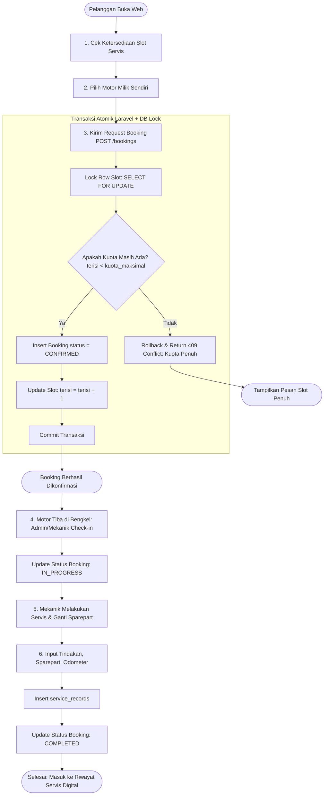

# SPESIFIKASI KEBUTUHAN SISTEM (REQUIREMENTS SPECIFICATION)

## 1. Requirement Extraction & Classification

Setiap requirement diklasifikasikan berdasarkan sumbernya:
- `[PDF]`: Kebutuhan eksplisit dari dokumen PDF acuan tugas kelompok.
- `[BASE]`: Keputusan arsitektur dan bisnis yang telah disepakati bersama.
- `[REK]`: Rekomendasi teknis arsitek sistem untuk keandalan produksi/akademik.
- `[ASUM]`: Asumsi desain yang menunggu verifikasi operasional lebih lanjut.

---

### A. Functional Requirements (FR)

#### Autentikasi & Pengguna (AUTH)
- **FR-AUTH-001 [PDF]**: Sistem harus menyediakan endpoint registrasi akun baru (`POST /api/v1/auth/register`) untuk pelanggan dengan data: nama, no_hp, email, password.
- **FR-AUTH-002 [PDF]**: Sistem harus menyediakan endpoint login (`POST /api/v1/auth/login`) yang menghasilkan token otorisasi (Laravel Sanctum).
- **FR-AUTH-003 [PDF]**: Sistem harus menyediakan endpoint profil pengguna aktif (`GET /api/v1/auth/me`) menggunakan Bearer Token.
- **FR-AUTH-004 [REK]**: Sistem harus menyediakan endpoint logout (`POST /api/v1/auth/logout`) untuk mencabut token aktif.
- **FR-AUTH-005 [BASE]**: Sistem harus membedakan hak akses berdasarkan 3 role pengguna: `CUSTOMER`, `MECHANIC`, dan `ADMIN`.

#### Manajemen Kendaraan Pelanggan (VEH)
- **FR-VEH-001 [PDF]**: Sistem harus memungkinkan pelanggan mendaftarkan kendaraan motor miliknya (`POST /api/v1/vehicles`) dengan atribut: nomor polisi, merk, model, dan tahun pembuatan.
- **FR-VEH-002 [PDF]**: Sistem harus menampilkan daftar seluruh motor yang dimiliki oleh pelanggan yang sedang login (`GET /api/v1/vehicles`).
- **FR-VEH-003 [PDF]**: Sistem harus menyediakan detail kendaraan spesifik (`GET /api/v1/vehicles/{id}`).
- **FR-VEH-004 [PDF]**: Sistem harus memungkinkan pelanggan mengubah data kendaraan miliknya (`PUT/PATCH /api/v1/vehicles/{id}`).
- **FR-VEH-005 [PDF]**: Sistem harus memungkinkan pelanggan menghapus kendaraan miliknya (`DELETE /api/v1/vehicles/{id}`).
- **FR-VEH-006 [REK]**: Sistem harus menolak pendaftaran nomor polisi kendaraan yang duplikat (Unique Constraint).

#### Manajemen Slot Servis & Kuota (SLOT)
- **FR-SLOT-001 [PDF]**: Sistem harus menyajikan data ketersediaan slot servis berdasarkan parameter filter tanggal (`GET /api/v1/service-slots?tanggal=YYYY-MM-DD`).
- **FR-SLOT-002 [PDF]**: Data slot servis harus memuat informasi tanggal, jam mulai, kuota maksimal, dan kuota yang sudah terisi.
- **FR-SLOT-003 [REK]**: Sistem hanya menampilkan slot servis yang kuotanya masih tersedia (`terisi < kuota_maksimal`) untuk pelanggan, atau menampilkan status ketersediaan secara eksplisit.
- **FR-SLOT-004 [REK]**: Admin harus dapat membuat dan mengonfigurasi kuota slot servis harian (`POST /api/v1/admin/service-slots`).

#### Reservasi & Pembatalan Booking (BOOK)
- **FR-BOOK-001 [PDF]**: Sistem harus memfasilitasi pelanggan untuk membuat reservasi servis motor (`POST /api/v1/bookings`) dengan memilih kendaraan miliknya, slot servis, dan mencatat keluhan motor.
- **FR-BOOK-002 [BASE]**: Sistem harus menerapkan aturan **Auto-Confirm**: jika kuota slot masih tersedia, status booking langsung menjadi `CONFIRMED` saat request berhasil divalidasi dan kuota diamankan.
- **FR-BOOK-003 [BASE]**: Sistem harus menolak request reservasi dengan respons error terstruktur apabila kuota slot waktu yang dipilih sudah penuh.
- **FR-BOOK-004 [PDF]**: Sistem harus mengizinkan pelanggan membatalkan booking servis miliknya (`POST /api/v1/bookings/{id}/cancel`) selama status servis belum dikerjakan.
- **FR-BOOK-005 [BASE]**: Saat pembatalan booking berhasil, sistem harus secara otomatis mengurangi kuota terisi pada slot terkait (`terisi = terisi - 1`).
- **FR-BOOK-006 [REK]**: Sistem harus mencegah pelanggan memesan lebih dari 1 booking aktif pada slot atau tanggal yang sama untuk kendaraan yang sama.

#### Operasional Bengkel & Penerimaan (CHECKIN)
- **FR-OPS-001 [REK]**: Admin/Mekanik dapat memperbarui status kedatangan kendaraan di bengkel menjadi `IN_PROGRESS` (`POST /api/v1/bookings/{id}/check-in`).
- **FR-OPS-002 [REK]**: Sistem harus memvalidasi bahwa hanya booking berstatus `CONFIRMED` yang dapat diproses ke tahap pengerjaan.

#### Pencatatan Servis oleh Mekanik (SERV)
- **FR-SERV-001 [PDF]**: Mekanik harus dapat menginput catatan tindakan servis dan penggantian suku cadang (`POST /api/v1/service-records`) terkait booking yang sedang dikerjakan.
- **FR-SERV-002 [PDF]**: Data rekam servis mencakup: kilometer odometer kendaraan terkini, rincian tindakan perbaikan, daftar suku cadang yang diganti, dan catatan khusus mekanik.
- **FR-SERV-003 [REK]**: Saat rekam servis diselesaikan, status booking otomatis diperbarui menjadi `COMPLETED`.

#### Riwayat Servis & Pencarian Nomor Polisi (HIST)
- **FR-HIST-001 [PDF]**: Sistem harus menyediakan endpoint riwayat servis kendaraan (`GET /api/v1/vehicles/{id}/service-history`).
- **FR-HIST-002 [PDF]**: Sistem harus mendukung pencarian riwayat servis berdasarkan nomor polisi kendaraan (`GET /api/v1/service-history/search?no_polisi=G1234ABC`) untuk kebutuhan operasional bengkel/mekanik.
- **FR-HIST-003 [BASE]**: Pelanggan hanya dapat melihat riwayat servis untuk kendaraan yang terdaftar sebagai miliknya. Mekanik dan Admin dapat melihat riwayat servis seluruh kendaraan untuk analisis teknis kerusakan masa lalu.

---

### B. Non-Functional Requirements (NFR)

- **NFR-SEC-001 [BASE]**: Autentikasi menggunakan stateless Bearer Token (Laravel Sanctum).
- **NFR-SEC-002 [BASE]**: Strict Authorization Policy: Customer tidak dapat melihat, mengubah, atau menghapus kendaraan, booking, atau data milik customer lain (Ownership Enforcement).
- **NFR-SEC-003 [REK]**: Seluruh kata sandi wajib di-hash menggunakan algoritma Bcrypt / Argon2ID dengan cost factor aman.
- **NFR-SEC-004 [REK]**: Input request wajib divalidasi ketat melalui Laravel Form Request validation untuk mencegah Mass Assignment, SQL Injection, dan XSS.
- **NFR-PERF-001 [REK]**: Waktu respons API (Response Time) untuk request umum harus berada di bawah 200 ms pada lingkungan lokal.
- **NFR-RELI-001 [BASE]**: Sistem harus tahan terhadap kondisi balapan (Race Condition / Concurrency Overbooking) menggunakan mekanisme transaksi database atomik dan row-level locking (`SELECT ... FOR UPDATE`).
- **NFR-RESP-001 [BASE]**: Antarmuka web frontend harus sepenuhnya responsif untuk smartphone (360px+), tablet (768px+), dan layar desktop (1024px+).
- **NFR-PWA-001 [BASE]**: Arsitektur frontend harus dirancang siap PWA (PWA-Ready), dilengkapi Web App Manifest dan konfigurasi Service Worker untuk caching aset statis.
- **NFR-TEST-001 [PDF]**: Seluruh endpoint API wajib memiliki pengujian respon fungsional dan kepatuhan standar HTTP status code (200, 201, 204, 400, 401, 403, 404, 409, 422, 500).

---

### C. Business Rules (BR)

- **BR-AUTH-001**: Email pengguna harus unik di seluruh sistem.
- **BR-VEH-001**: Nomor polisi kendaraan harus unik dan dinormalisasi (huruf kapital, tanpa spasi ganda).
- **BR-VEH-002**: Kendaraan yang sedang memiliki booking aktif (`CONFIRMED` atau `IN_PROGRESS`) tidak dapat dihapus dari sistem.
- **BR-SLOT-001**: Kuota slot servis tidak boleh terisi melebihi `kuota_maksimal` (`terisi <= kuota_maksimal`).
- **BR-BOOK-001 (Auto-Confirm)**: Reservasi otomatis disetujui (`status = 'CONFIRMED'`) saat dibuat jika slot waktu masih memiliki kuota kosong.
- **BR-BOOK-002**: Pemesanan hanya dapat dilakukan untuk slot waktu yang belum lewat dari waktu saat ini.
- **BR-BOOK-003**: Pembatalan booking oleh pelanggan hanya diizinkan jika status booking masih `CONFIRMED`. Jika status sudah `IN_PROGRESS` atau `COMPLETED`, pembatalan ditolak.
- **BR-BOOK-004**: Saat booking dibatalkan (`CANCELLED`), kuota slot dikembalikan (`terisi = terisi - 1`) secara atomik.
- **BR-SERV-001**: Pengisian `service_records` hanya dapat dilakukan satu kali per booking id, dan hanya untuk booking berstatus `IN_PROGRESS`.
- **BR-SERV-002**: Pengisian `service_records` yang valid otomatis memicu transisi status booking menjadi `COMPLETED`.

---

### D. User Roles & Permission Matrix

| Fitur / Endpoint | Role: CUSTOMER | Role: MECHANIC | Role: ADMIN | Aturan Otorisasi Khusus |
|---|:---:|:---:|:---:|---|
| **Register & Login** | Ya | Ya (Dibuat Admin) | Ya | Publik |
| **Kelola Profil Sendiri (Me)** | Ya | Ya | Ya | Hanya data profil token aktif |
| **CRUD Kendaraan Sendiri** | Ya | Tidak | Ya | Customer hanya ID kendaraan miliknya |
| **Lihat Ketersediaan Slot** | Ya | Ya | Ya | Publik / Terautentikasi |
| **Kelola Slot Harian (Admin)** | Tidak | Tidak | Ya | Khusus Admin |
| **Buat Booking (Auto-Confirm)** | Ya | Tidak | Ya | Customer untuk motor sendiri; Admin atas nama pelanggan |
| **Batalkan Booking Sendiri** | Ya | Tidak | Ya | Hanya status CONFIRMED |
| **Check-in / Mulai Servis** | Tidak | Ya | Ya | Transisi status CONFIRMED -> IN_PROGRESS |
| **Input Tindakan & Sparepart** | Tidak | Ya | Ya | Mencatat Odometer, Tindakan, Spareparts |
| **Cari Riwayat via No Polisi** | Hanya motor sendiri | Ya (Semua motor) | Ya (Semua motor) | Mekanik butuh riwayat saat pengerjaan |

---

### E. Business Process Flowchart (Mermaid)

